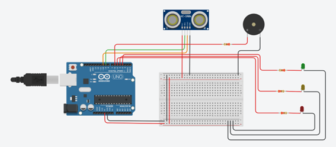

## 🖼️ Esquema de Ligação



---

## 🔧 Componentes Utilizados

| Componente | Quantidade | Observações |
|-------------|-------------|-------------|
| Arduino UNO R3 | 1 | Controlador principal |
| Sensor Ultrassônico HC-SR04 | 1 | Mede distância até o obstáculo |
| LED Verde | 1 | Indica distância segura |
| LED Amarelo | 1 | Indica atenção |
| LED Vermelho | 1 | Indica perigo |
| Buzzer (ativo ou passivo) | 1 | Emite som de aviso |
| Resistores (220–330 Ω) | 3 | Limitam corrente dos LEDs |
| Jumpers e Protoboard | — | Conexões elétricas |

---

## ⚙️ Ligações dos Pinos

| Componente | Pino Arduino | Descrição |
|-------------|---------------|------------|
| HC-SR04 TRIG | 9 | Envia o pulso ultrassônico |
| HC-SR04 ECHO | 10 | Recebe o eco do pulso |
| LED Verde | 3 | Indica “distância segura” |
| LED Amarelo | 4 | Indica “atenção” |
| LED Vermelho | 5 | Indica “alerta” |
| Buzzer | 6 | Emite sinal sonoro |
| GND | — | Todos interligados |
| VCC (5V) | — | Alimenta o sensor e LEDs |

---

## 🧩 Funcionamento Lógico

O sistema mede continuamente a distância até um obstáculo e indica o estado atual conforme os limites definidos:

| Situação | Distância (cm) | Ações |
|-----------|----------------|-------|
| 🟢 **Segura** | > 40 cm | LED verde aceso, buzzer desligado |
| 🟡 **Atenção** | 20–40 cm | LED amarelo piscando, buzzer lento |
| 🔴 **Perigo** | ≤ 20 cm | LED vermelho piscando rápido, buzzer rápido |

---

## 🔊 Tipos de Buzzer Suportados

O código suporta **buzzer ativo** e **buzzer passivo**:

- **Ativo:** liga/desliga com `digitalWrite()`.
- **Passivo:** utiliza `tone()` com frequência configurável.

Defina o tipo do seu buzzer na constante abaixo:
```cpp
const bool BUZZER_PASSIVO = true; // true = passivo | false = ativo
🧮 Cálculo da Distância
O cálculo é feito com base no tempo de ida e volta do som:

cpp
Copiar código
distancia (cm) = (tempo_em_microsegundos * 0.034) / 2
Para reduzir ruídos nas leituras, o código faz uma média de 3 medições válidas:

cpp
Copiar código
float medirDistanciaMediaCm(byte n = 3);
⏱️ Piscar e Beep Não-Bloqueantes
O projeto utiliza millis() para controlar o tempo entre piscadas e beeps, sem usar delay().
Isso permite que LEDs e buzzer funcionem em paralelo, mantendo a leitura do sensor fluida.

🧰 Parâmetros Personalizáveis
Parâmetro	Valor Padrão	Descrição
LIMITE_VERDE	40 cm	Distância segura (LED verde)
LIMITE_VERMELHO	20 cm	Distância de alerta máximo
BLINK_AMARELO_MS	500 ms	Intervalo de piscada do LED amarelo
BLINK_VERMELHO_MS	200 ms	Intervalo de piscada do LED vermelho
BEEP_LENTO_MS	500 ms	Intervalo do beep lento
BEEP_RAPIDO_MS	150 ms	Intervalo do beep rápido

🧪 Teste e Depuração
Monte o circuito conforme o esquema.

Envie o código para o Arduino pela IDE.

(Opcional) Abra o Monitor Serial e adicione prints na função medirDistanciaMediaCm() para acompanhar as leituras.

Aproxime e afaste um objeto para verificar o acionamento dos LEDs e do buzzer.

💡 Possíveis Extensões
📟 Adicionar display LCD 16x2 para exibir distância em tempo real.

📶 Integrar com módulo Wi-Fi (ESP8266) para envio dos dados a um app/web.

🔉 Implementar buzzer com frequência variável conforme a distância.

🌡️ Corrigir a leitura de distância com base na temperatura do ar.

📁 Estrutura do Projeto
bash
Copiar código
Sensor_Estacionamento/
├── Sensor_Estacionamento_Completo.png   # Esquema de montagem
├── Sensor_Estacionamento.ino            # Código-fonte Arduino
└── README.md                            # Este arquivo
